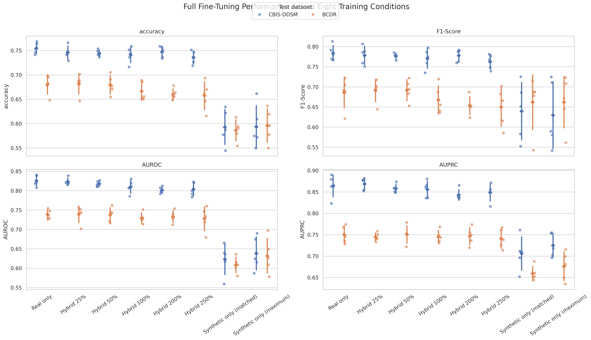

# Evaluating Hybrid Real and Synthetic Datasets for Breast Mass Classification

This repository contains the code, experiment definitions and aggregated results for a study of additive synthetic-data augmentation in mammographic mass classification. A fully fine-tuned ImageNet-pretrained Swin-Tiny classifier was evaluated under eight training conditions, using five seeds per condition. Model selection used real CBIS-DDSM validation data; final evaluation used held-out CBIS-DDSM masses, and the external BCDR dataset.

The main finding is that small synthetic additions largely preserve real-only performance, but no hybrid ratio produces a consistent improvement across metrics and datasets. Larger additions generally reduce performance, while synthetic-only models transfer substantially worse than conditions containing real images.

## Study design

| Condition | Real training images | Synthetic images | Seeds |
|---|---:|---:|---|
| Real only | 1,104 | 0 | 42–46 |
| Hybrid 25% | 1,104 | 276 | 42–46 |
| Hybrid 50% | 1,104 | 552 | 42–46 |
| Hybrid 100% | 1,104 | 1,104 | 42–46 |
| Hybrid 200% | 1,104 | 2,208 | 42–46 |
| Hybrid 250% | 1,104 | 2,760 | 42–46 |
| Synthetic only (matched) | 0 | 1,104 | 42–46 |
| Synthetic only (maximum) | 0 | 3,000 | 42–46 |

Every condition uses the same Swin-Tiny architecture and optimization protocol: 224 × 224 inputs, batch size 64, 300 epochs, AdamW, learning rate `1e-5`, weight decay `1e-8`, and label smoothing `0.1`. The checkpoint with the lowest real CBIS-DDSM validation loss is evaluated on both real test datasets. Benign masses are encoded as the positive class.

## Repository contents

```text
gan_compare/
├── configs/swin/hybrid_experiments/full_ft/   # seed-specific YAML files
├── dataset/                                   # real and synthetic dataset loaders
├── notebooks/full_ft_evaluation.ipynb         # paper evaluation
├── scripts/hybrid_experiments/                # SLURM entry points
└── scripts/train_test_classifier.py           # training and testing
extension/hybrid_experiments/full_ft/
└── evaluation_exports/                        # committed aggregate results and figures
setup/                                         # metadata and split definitions from upstream
environment.yml                                # reproducible Conda environment
NOTICE                                         # upstream attribution and modifications
```

Medical images, generated image files, model checkpoints and raw run logs are intentionally not stored in this repository.

## Quick start

The following sequence reproduces the released experiment setup from a fresh clone. Commands are run from the repository root.

1. Clone the repository and enter it:

   ```bash
   git clone https://github.com/lisame2001/Hybrid_Datasets_Breast_Cancer.git
   cd Hybrid_Datasets_Breast_Cancer
   ```

2. Obtain the processed real and synthetic patches from the pinned upstream release listed under [Data and external resources](#data-and-external-resources). Copy them into `dataset16062024/` and `extension/synthetic_data/cbis-ddsm/c-dcgan/` using the exact layout shown below. Do not commit these data directories.

3. Create and activate the software environment:

   ```bash
   conda env create -f environment.yml
   conda activate hybrid
   ```

Note: A working Conda installation is required. On systems where Conda is installed but not initialized in the current shell, initialize it first, for example with source ~/miniconda3/etc/profile.d/conda.sh.
   
4. Check all 40 configurations and the local image counts before training:

   ```bash
   python -m gan_compare.scripts.validate_full_ft_setup \
     --dataset-path dataset16062024 \
     --synthetic-data-dir extension/synthetic_data/cbis-ddsm/c-dcgan
   ```

5. Run either one configuration with the command under [Run one experiment](#run-one-experiment), or submit the complete eight-condition, five-seed array with the command under [Reproduce all paper experiments with SLURM](#reproduce-all-paper-experiments-with-slurm).

6. When all 40 text logs are present, execute `gan_compare/notebooks/full_ft_evaluation.ipynb` from top to bottom. The notebook validates completeness, recreates the tables and figures and writes them to `extension/hybrid_experiments/full_ft/evaluation_exports/`.

To inspect the reported results without GPUs or restricted medical data, skip steps 2–5 and open the committed CSV and PNG files in `extension/hybrid_experiments/full_ft/evaluation_exports/`.

## Upstream code and attribution

This work is based on [`RichardObi/mammo_dp`](https://github.com/RichardObi/mammo_dp) at commit [`20caed7`](https://github.com/RichardObi/mammo_dp/commit/20caed79441855870bae6f7efca1cac0ca8bac7e), released under the Apache License 2.0. The original code accompanies Osuala *et al.*, “Enhancing the Utility of Privacy-Preserving Cancer Classification using Synthetic Data.” The original license is retained in [`LICENSE`](LICENSE), and the principal changes made for this study are summarized in [`NOTICE`](NOTICE).

The present study adds deterministic class-balanced synthetic sampling, additive real-plus-synthetic training, five-seed full fine-tuning configurations, SLURM experiment arrays and a paired evaluation across CBIS-DDSM and BCDR.

## Data and external resources

| Resource | Use in this study | Source | Expected location |
|---|---|---|---|
| Processed CBIS-DDSM and BCDR mass patches | Real training, validation and testing | [`mammo_dp/dataset16062024`](https://github.com/RichardObi/mammo_dp/tree/20caed79441855870bae6f7efca1cac0ca8bac7e/dataset16062024) | `dataset16062024/` |
| CBIS-DDSM source data | Original mammograms | [The Cancer Imaging Archive](https://www.cancerimagingarchive.net/collection/cbis-ddsm/) | User-defined during preprocessing |
| BCDR source data | External evaluation set | [BCDR](https://bcdr.eu/information/about) (registration and the provider's access conditions may apply) | User-defined during preprocessing |
| Synthetic mass patches used by the upstream project | Hybrid and synthetic-only training | [`mammo_dp/extension/synthetic_data/cbis-ddsm`](https://github.com/RichardObi/mammo_dp/tree/20caed79441855870bae6f7efca1cac0ca8bac7e/extension/synthetic_data/cbis-ddsm) | `extension/synthetic_data/cbis-ddsm/c-dcgan/` |
| C-DCGAN generator | Optional regeneration of synthetic masses | [Medigan model 00008](https://github.com/RichardObi/medigan), weights on [Zenodo](https://doi.org/10.5281/zenodo.6647349) | Not required when using the released patches |

The eight reported classification conditions require the same processed real patches and the same pool of 3,000 synthetic patches. Regenerating images from the generator may produce a different pool and should therefore be considered a related replication rather than a byte-identical reproduction.

### Required directory layout

The directory names and filename labels use two corresponding conventions. Real images are stored in `is_benign_false` or `is_benign_true` directories, while their filenames end in `_is_benign_0.png` or `_is_benign_1.png`, respectively. The directory and filename label must agree because the loader derives the target label from the filename. Synthetic labels are identified by the words `_malignant` and `_benign` in their filenames.

```text
dataset16062024/
├── cbis-ddsm/
│   ├── train/
│   │   ├── is_benign_false/*_is_benign_0.png
│   │   └── is_benign_true/*_is_benign_1.png
│   ├── val/
│   │   ├── is_benign_false/*_is_benign_0.png
│   │   └── is_benign_true/*_is_benign_1.png
│   └── test/
│       ├── is_benign_false/*_is_benign_0.png
│       └── is_benign_true/*_is_benign_1.png
└── bcdr/
    └── test/
        ├── is_benign_false/*_is_benign_0.png
        └── is_benign_true/*_is_benign_1.png

extension/synthetic_data/cbis-ddsm/c-dcgan/
├── batch_<batch>_<index>_malignant.png
└── batch_<batch>_<index>_benign.png
```

The real-data splits used in the reported experiments contain 1,104 CBIS-DDSM training images, 192 CBIS-DDSM validation images, 402 CBIS-DDSM internal test images, and 1,106 external BCDR test images.

The committed file [`setup/paper_data_manifest.csv`](setup/paper_data_manifest.csv) records the relative path, dataset, split, class label, file size, and SHA-256 checksum of every real and synthetic image used in the study. Passing `--verify-checksums` verifies the local files against this manifest in addition to checking the configuration matrix and class-specific image counts.

The manifest identifies eight pairs of byte-identical files within the BCDR test split. Seven pairs share the same label, while one pair has discordant labels. No byte-identical files occur across the training, validation, CBIS-DDSM test, or BCDR test partitions. The duplicate BCDR entries were retained because they are part of the processed dataset used for all reported evaluations.
 Before launching jobs, validate both the configuration matrix and local data layout:

```bash
python -m gan_compare.scripts.validate_full_ft_setup \
  --dataset-path dataset16062024 \
  --synthetic-data-dir extension/synthetic_data/cbis-ddsm/c-dcgan \
  --verify-checksums
```

## Environment setup

The experiments were run on Linux with Python 3.10.20, PyTorch 2.3.1, torchvision 0.18.1, CUDA 12.1 and cuDNN 8.9.2 in the Conda environment `hybrid`. Create the environment from the committed specification:

```bash
conda env create -f environment.yml
conda activate hybrid
```

CUDA must be available for GPU training. Confirm the environment before submitting jobs:

```bash
python --version
python -c "import torch; print(torch.__version__, torch.version.cuda, torch.cuda.is_available())"
```

The versions of all direct Python dependencies used by the pipeline are pinned in [`requirements.txt`](requirements.txt). PyTorch wheels install their own CUDA runtime dependencies; the host still requires a compatible NVIDIA driver. The reported environment returned `torch==2.3.1+cu121`, `torchvision==0.18.1+cu121`, CUDA 12.1, and cuDNN 8.9.2.

The pretrained Swin-Tiny weights are downloaded automatically by PyTorch on first use. A network connection or a populated framework cache is therefore required for the first run.

## Run one experiment

Run commands from the repository root. The following reproduces Hybrid 25% with seed 42:

```bash
python -m gan_compare.scripts.train_test_classifier \
  --config_path gan_compare/configs/swin/hybrid_experiments/full_ft/hybrid_025_seed42.yaml \
  --dataset_path dataset16062024 \
  --device cuda \
  --seed 42
```

Run this command on a CUDA-capable machine or an allocated GPU compute node.
Each configuration writes a text log and model checkpoints below `extension/hybrid_experiments/full_ft/<condition>_seed<seed>/`. These generated outputs are ignored by Git.

## Reproduce all paper experiments with SLURM

The portable paper array contains all 40 runs (eight conditions × five seeds):

```bash
mkdir -p slurm_logs
sbatch gan_compare/scripts/hybrid_experiments/run_full_ft_paper.sbatch
```

The script defaults to the Conda environment `hybrid` and dataset directory `dataset16062024`. Override them without editing the script:

```bash
CONDA_ENV_NAME=my_environment \
DATASET_PATH=/path/to/dataset16062024 \
CONDA_SH=/path/to/conda.sh \
sbatch gan_compare/scripts/hybrid_experiments/run_full_ft_paper.sbatch
```

The SLURM partition, GPU request, memory and time limit reflect the original HPC setup and may need adjustment for another cluster. The original runs used one NVIDIA GPU, four CPU cores, 16 GB system memory and a 2.5-hour limit per task.

## Reproduce the evaluation

After all 40 logs are present, start Jupyter from the repository root and run:

```bash
jupyter lab gan_compare/notebooks/full_ft_evaluation.ipynb
```

The notebook:

1. requires exactly one experiment log for every condition and seed;
2. extracts the checkpoint selected by minimum validation loss;
3. extracts one CBIS-DDSM and one BCDR test result from each run;
4. asserts 80 result rows (40 runs × two test datasets);
5. exports per-seed results, aggregate mean and standard deviation, paired differences from real-only training, and figures.

Committed outputs are available in [`extension/hybrid_experiments/full_ft/evaluation_exports`](extension/hybrid_experiments/full_ft/evaluation_exports). They allow the reported numerical results to be inspected without rerunning GPU training. Raw logs and checkpoints are excluded because of their size.

## Reproducibility notes

- Seeds 42–46 control classifier training and synthetic subset selection.
- Synthetic filenames are sorted before a seed-specific shuffle.
- Each requested synthetic subset is class-balanced and sampled without replacement.
- Conditions sharing a seed are compared with the real-only run carrying that seed.
- The external BCDR results are never used for model or threshold selection.
- Precision, recall, F1-score, and AUPRC use benign as the positive class.
- The original pipeline applies random horizontal and vertical flips during training; validation and test transforms only normalize the images.

PyTorch/CUDA operations can remain nondeterministic across GPU architectures and software builds even when seeds are fixed. The environment specification and seed design reduce this variability but do not imply bitwise-identical model weights on every system.

## Results

The aggregate results and paired differences are provided as CSV files. The main comparison figure is shown below.



Small hybrid additions remain close to the real-only baseline. Hybrid 25% increases internal AUPRC by 0.0045, and Hybrid 50% increases external AUPRC by 0.0007, but neither improvement is consistent across metrics and datasets. Larger synthetic additions generally reduce performance. Both synthetic-only conditions perform substantially worse than every condition containing real training images.

## Citation

If you use this repository, please cite the accompanying seminar paper:

```bibtex
@misc{mesch2026hybrid,
  author       = {Schäfer, Saskia and Pautz, Katja and Mesch, Lisa Marie},
  title        = {Evaluating Hybrid Real and Synthetic Datasets for Breast Mass Classification},
  year         = {2026},
  howpublished = {Seminar paper, Cognitive Science, University of Osnabrück},
  note         = {Seminar: Enhancing AI Through Hybrid Datasets},
  url          = {https://github.com/lisame2001/Hybrid_Datasets_Breast_Cancer}
}
```

This work builds on the following study and implementation:

```bibtex
@article{osuala2024enhancing,
  title   = {Enhancing the Utility of Privacy-Preserving Cancer Classification using Synthetic Data},
  author  = {Osuala, Richard and Lang, Daniel M. and Riess, Anneliese and Kaissis, Georgios and Szafranowska, Zuzanna and Skorupko, Grzegorz and Diaz, Oliver and Schnabel, Julia A. and Lekadir, Karim},
  journal = {arXiv preprint arXiv:2407.12669},
  year    = {2024},
  url     = {https://arxiv.org/abs/2407.12669}
}
```

## License

The repository retains the upstream Apache License 2.0. Dataset access and reuse remain subject to the terms of the respective data providers; the software license does not grant rights to redistribute medical imaging data.
